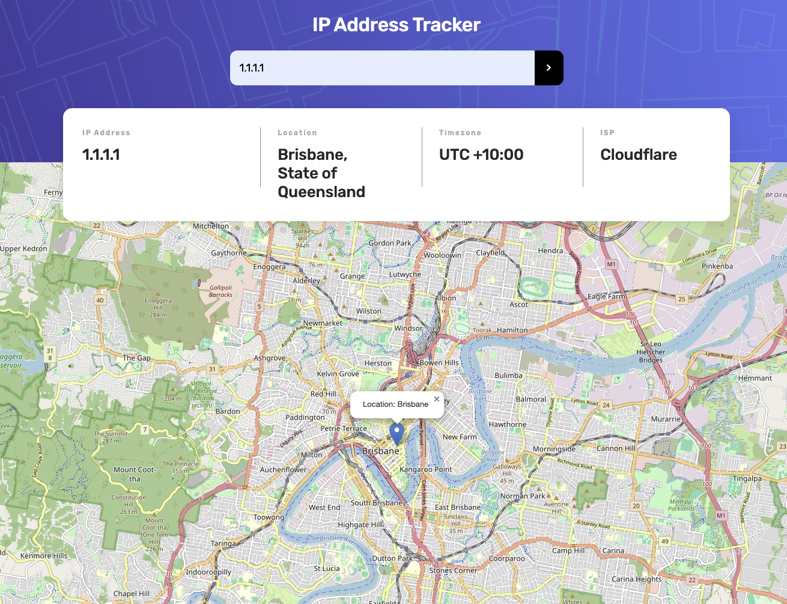

# IP Address Tracker

  

## Overview

A simple web application that tracks IP addresses and domains, displaying their geolocation data on a map using the Geo.ipify API.

### Features

- Search for IP addresses or domains to get location details.
- Display IP address, location (city, region), timezone, and ISP information.
- Visualize the location on an interactive map using Leaflet.
- Handle both IPv4 and domain inputs with client-side validation.
- Responsive design for desktop and mobile.

### Technologies

- HTML5: Structure of the web page.
- CSS3: Styling with a custom stylesheet (index.css).
- JavaScript: Client-side logic (script.js) with Leaflet for mapping.
- Leaflet: Open-source JavaScript library for interactive maps.
- Geo.ipify API: Provides geolocation data for IPs and domains.
- Netlify: Hosting and serverless functions for API requests.
- node-fetch: Used in the Netlify function for HTTP requests.

## Demo

Try the live app at [here](https://js-ip-address-tracker.netlify.app/). Add, edit, delete, and filter tasks with smooth animations.

## Getting Started

### Prerequisites

- Node.js and npm installed for local development (optional).
- A Geo.ipify API key (stored as an environment variable on Netlify).

### Installation

#### 1. Clone the repository:

- git clone https://github.com/vanessacl/ip-address-tracker.git

#### 2. Navigate to the project directory:

- cd ip-address-tracker

#### Install dependencies (if running locally):

- npm install

#### 3. Compile Sass:

- Ensure Sass compiles scss/index.scss (or your Sass file) to css/index.css:

#### 4. Serve the application:

- Use a local server (e.g., VS Code Live Server) or open index.html in a browser.

#### 5. Set up the Geo.ipify API key as an environment variable named API_KEY in Netlify.

## Deployment

- Deploy the project to Netlify by connecting your GitHub repository.
- Ensure the netlify.toml file is included to configure the function and redirect routes.
- The app will be live at the Netlify-provided URL (e.g., https://your-app.netlify.app).

## Usage

1. Open the app in a web browser.
2. Enter an IP address (e.g., 8.8.8.8) or domain (e.g., google.com) in the search bar.
3. lick the search button or press Enter to fetch and display the geolocation data.
4. The map will update to show the location, with a popup indicating the city.

## File Structure

- index.html: Main HTML structure.
- css/index.css: Custom styles.
- js/script.js: Client-side JavaScript logic.
- netlify/functions/get-ip-data.js: Serverless function to fetch Geo.ipify data.
- netlify.toml: Netlify configuration.
- package.json: Project metadata and dependencies.
- libs/leaflet/: Leaflet library files.

## Contributing

Feel free to submit issues or pull requests on the GitHub repository.

## Acknowledgments

- Geo.ipify for the geolocation API.
- Leaflet for the mapping library.
- Netlify for hosting and serverless functions.

## License

This project is licensed under the MIT License.
