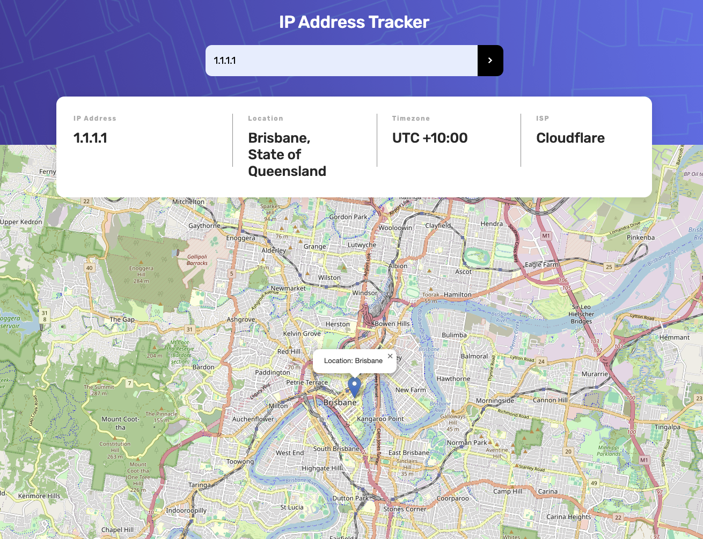

# IP Address Tracker

Look up an IP address or domain and see location, timezone, and ISP on an interactive map.



**Live demo:** [js-ip-address-tracker.netlify.app](https://js-ip-address-tracker.netlify.app/)

## What it does
- Search by IPv4 or domain
- Shows IP, city/region, timezone, and ISP
- Pins the result on a Leaflet map
- Keeps the Geo.ipify API key off the client via a Netlify Function
  
## Stack
HTML · Sass/CSS · JavaScript · Leaflet · Geo.ipify · Netlify Functions · node-fetch

## Run locally
```bash
git clone https://github.com/vanessacl/ip-address-tracker.git
cd ip-address-tracker
npm install
```

Open <code>index.html</code> with a local server.

For the Netlify function path, set <code>API_KEY</code> to your Geo.ipify key in the Netlify environment (or local Netlify Dev).

## Why this project
A small full-path front-end feature: third-party API, map UI, input validation, and keeping secrets out of the browser bundle.

## License

This project is licensed under the MIT License.
